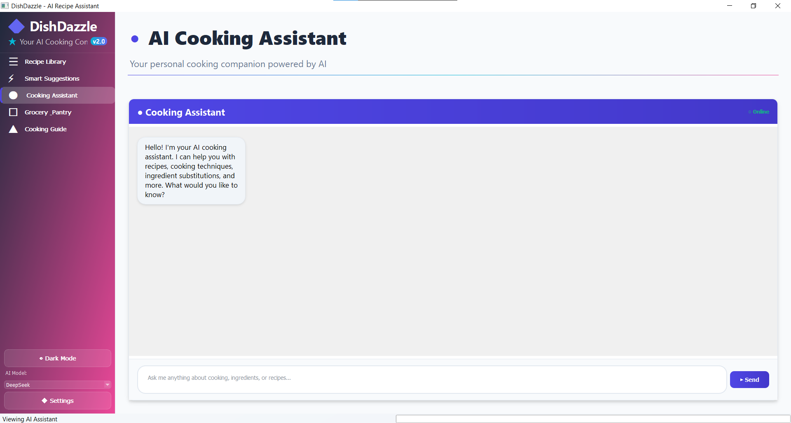
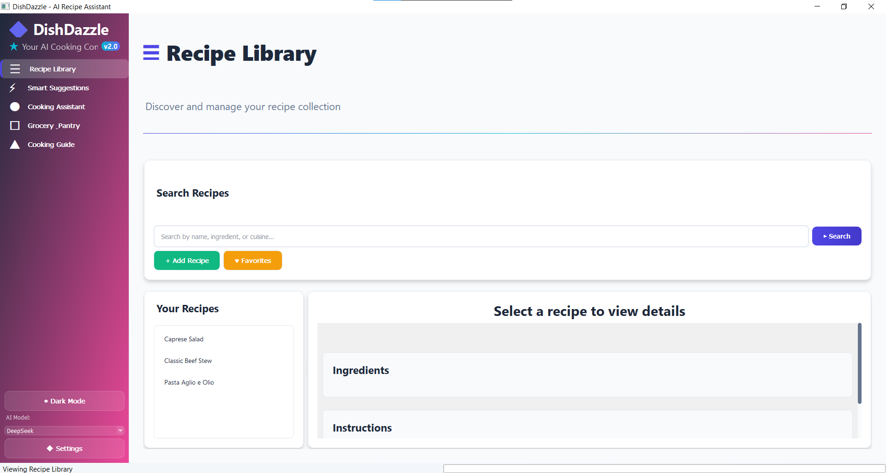
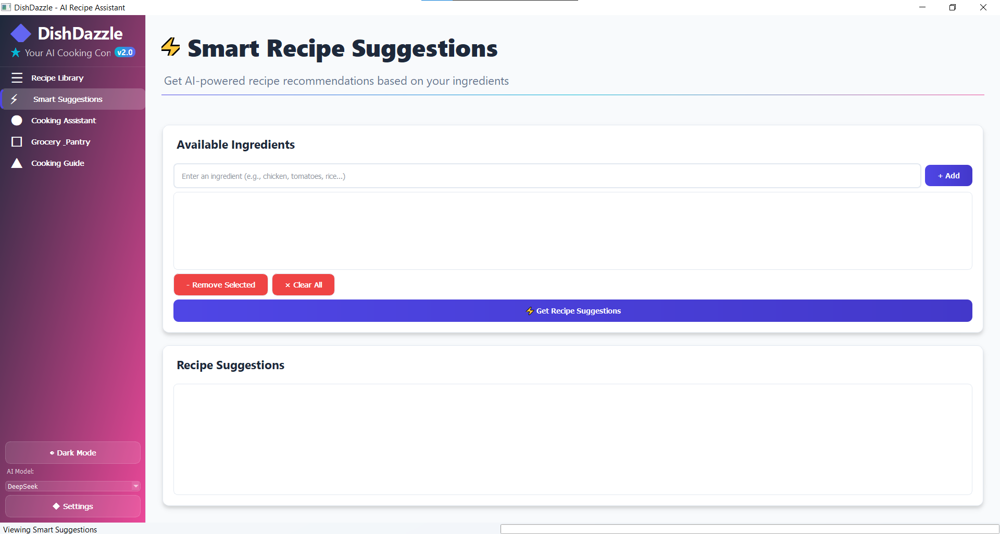
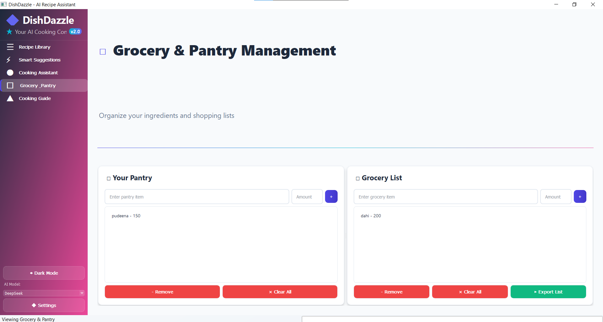
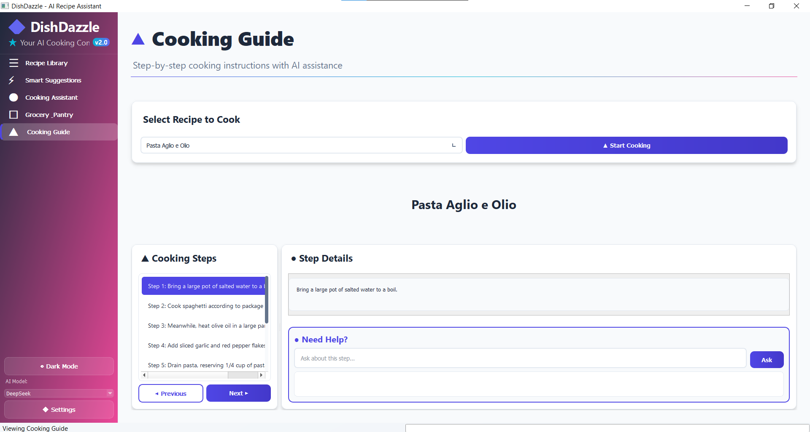
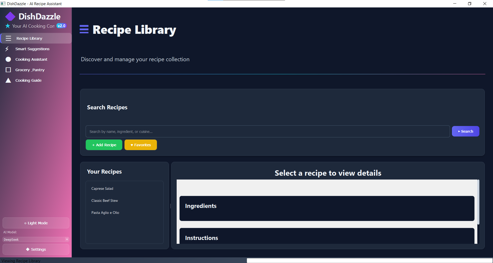

# 🍽️ DishDazzle - AI Recipe Assistant

> **Your intelligent cooking companion powered by AI**

<div align="center">


</div>

DishDazzle is a modern, AI-powered desktop recipe assistant developed by <b><i>Muhammad Hashir Suleman</i></b> that transforms your cooking experience. Discover recipes based on available ingredients, manage grocery lists efficiently, get real-time cooking assistance, and enjoy a beautiful, responsive user interface.

## ✨ Key Features

### 🔍 **Smart Recipe Discovery**
- **Recipe Library**: Browse, search, and organize your recipe collection with advanced filtering
- **AI-Powered Suggestions**: Get personalized recipe recommendations based on available ingredients
- **Intelligent Search**: Find recipes by name, ingredient, cuisine type, or dietary preferences
- **Favorites System**: Save and organize your favorite recipes for quick access

### 🤖 **AI Cooking Assistant**
- **Real-time Chat**: Get instant cooking advice and culinary guidance
- **Contextual Help**: Ask questions about specific recipe steps or cooking techniques
- **Ingredient Substitutions**: Find alternatives when you're missing ingredients
- **Markdown Support**: Beautifully formatted responses with headers, lists, and emphasis

### 🛒 **Smart Grocery Management**
- **Auto-Generated Lists**: Create grocery lists from recipes automatically
- **Pantry Integration**: Track what you have to avoid buying duplicates
- **Export Functionality**: Export lists to text files for shopping
- **Smart Filtering**: Only add ingredients you don't already have

### 👨‍🍳 **Step-by-Step Cooking Guide**
- **Interactive Instructions**: Navigate through recipe steps with visual guidance
- **Contextual Assistance**: Get help with specific cooking steps
- **Progress Tracking**: Keep track of your cooking progress
- **Responsive Design**: Adapts to different screen sizes and orientations

### 🎨 **Modern User Experience**
- **Beautiful Interface**: Clean, modern design with professional styling
- **Responsive Layout**: Adapts seamlessly to different window sizes
- **Theme Support**: Switch between light and dark modes
- **Smooth Interactions**: Polished animations and visual feedback
- **Accessibility**: Designed with usability and accessibility in mind

### 🔧 **Advanced AI Integration**
- **Multiple AI Models**: Support for DeepSeek v3.1 and Llama 3.3 70B Instruct
- **OpenRouter API**: Reliable and fast AI responses
- **Thread-Safe Operations**: Smooth UI experience with background processing
- **Intelligent Caching**: Optimized API usage with response caching

## 📱 UI

Experience the modern and intuitive user interface of DishDazzle:

<div align="center">

### Main Application Interface



### Recipe Discovery



### AI Cooking Assistant



### Recipe Management



### Grocery List Integration



### Settings & Configuration



</div>

> 💡 **Note**: The UI adapts beautifully to different screen sizes and provides a responsive cooking experience on desktop platforms.

## 🚀 Quick Start

### Prerequisites

- **Python 3.8+** (3.9+ recommended)
- **pip** package manager
- **OpenRouter API Key** ([Get one here](https://openrouter.ai/))

### Installation

1. **Clone the repository**:
   ```bash
   git clone https://github.com/yourusername/DishDazzle.git
   cd DishDazzle
   ```

2. **Create virtual environment** (recommended):
   ```bash
   python -m venv venv
   
   # On Windows
   venv\Scripts\activate
   
   # On macOS/Linux
   source venv/bin/activate
   ```

3. **Install dependencies**:
   ```bash
   pip install -r requirements.txt
   ```

4. **Run the application**:
   ```bash
   python src/main.py
   ```

5. **Setup API Key**:
   - On first run, configure your OpenRouter API key in Settings
   - Choose your preferred AI model (DeepSeek or Llama)
   - Start cooking! 🍳

## 🏗️ Building Executable

### Windows
```bash
pyinstaller --onefile --windowed --name="DishDazzle" src/main.py
```

### macOS/Linux
```bash
chmod +x build_exe.sh
./build_exe.sh
```

Executable will be created in the `dist/` directory.

## 📁 Project Structure

```
DishDazzle/
├── 📁 src/                    # 🐍 Source code
│   ├── main.py                # Application entry point
│   ├── ui.py                  # Modern UI components and layouts
│   ├── api.py                 # AI API integration (OpenRouter)
│   ├── database.py            # SQLite database operations
│   ├── models.py              # Data models and schemas
│   └── utils.py               # Utility functions and helpers
├── 📁 tests/                  # 🧪 Unit and integration tests
│   ├── test_api.py           # API integration tests
│   ├── test_database.py      # Database operation tests
│   └── test_ui.py            # UI component tests
├── 📁 docs/                   # 📚 Documentation
│   ├── api_setup_guide.md    # API configuration guide
│   ├── user_manual.md        # Comprehensive user manual
│   └── report.md             # Technical project report
├── 📁 config/                 # ⚙️ Configuration files
│   └── config.json           # Application settings (auto-generated)
├── 📁 data/                   # 💾 Database storage
│   └── recipes.db            # SQLite database (auto-generated)
├── 📁 logs/                   # 📋 Application logs
├── requirements.txt           # 📦 Python dependencies
├── build_exe.sh              # 🔨 Build script for executables
├── .gitignore                # 🚫 Git ignore rules
└── README.md                 # 📖 This file
```

## 🔧 Development

### Setting Up Development Environment

1. **Fork and clone** the repository
2. **Create virtual environment**:
   ```bash
   python -m venv venv
   source venv/bin/activate  # On Windows: venv\Scripts\activate
   ```
3. **Install development dependencies**:
   ```bash
   pip install -r requirements.txt
   pip install pytest pytest-qt pytest-cov  # Testing tools
   ```

### Running Tests

```bash
# Run all tests
pytest

# Run with coverage report
pytest --cov=src --cov-report=html

# Run specific test file
pytest tests/test_api.py

# Run tests with verbose output
pytest -v
```

### Code Quality

```bash
# Format code with black
black src/ tests/

# Sort imports
isort src/ tests/

# Lint with flake8
flake8 src/ tests/
```

### Development Guidelines

- ✅ **Follow PEP 8** coding standards
- ✅ **Write tests** for new features
- ✅ **Document functions** with docstrings
- ✅ **Use type hints** where appropriate
- ✅ **Keep functions small** and focused
- ✅ **Handle errors gracefully**

## 🤝 Contributing

1. **Fork** the repository
2. **Create feature branch**: `git checkout -b feature/amazing-feature`
3. **Make changes** and add tests
4. **Run tests**: `pytest`
5. **Commit changes**: `git commit -m 'Add amazing feature'`
6. **Push to branch**: `git push origin feature/amazing-feature`
7. **Open Pull Request**

## 📋 Requirements

### System Requirements
- **OS**: Windows 10+, macOS 10.14+, or Linux
- **RAM**: 4GB minimum (8GB recommended)
- **Storage**: 500MB free space
- **Internet**: Required for AI features

### Python Dependencies
- **PyQt5** >= 5.15.0 - GUI framework
- **requests** >= 2.28.0 - HTTP requests
- **sqlite3** - Database (built-in)
- **openai** >= 1.0.0 - AI API client
- **httpx** >= 0.24.0 - Async HTTP client

## 🐛 Troubleshooting

### Common Issues

**API Connection Problems**
- ✅ Check internet connection
- ✅ Verify API key in Settings
- ✅ Ensure sufficient API credits

**UI Responsiveness**
- ✅ Minimum window size: 1000x700
- ✅ Try restarting the application
- ✅ Check system requirements

**Installation Issues**
- ✅ Use Python 3.8 or higher
- ✅ Update pip: `pip install --upgrade pip`
- ✅ Use virtual environment

### Getting Help

- 📖 Check the [User Manual](docs/user_manual.md)
- 🔧 Read the [API Setup Guide](docs/api_setup_guide.md)
- 🐛 [Open an issue](https://github.com/yourusername/DishDazzle/issues)
- 💬 Join our community discussions

## 📊 Features Comparison

| Feature | DishDazzle v2.0 | Other Recipe Apps |
|---------|----------------|------------------|
| AI Recipe Suggestions | ✅ Advanced | ❌ Basic/None |
| Real-time Cooking Help | ✅ Conversational | ❌ Static |
| Markdown Formatting | ✅ Beautiful | ❌ Plain Text |
| Responsive Design | ✅ Modern | ❌ Fixed |
| Multiple AI Models | ✅ DeepSeek + Llama | ❌ Limited |
| Offline Functionality | ✅ Partial | ❌ Internet Required |
| Theme Support | ✅ Light + Dark | ❌ Single Theme |
| Open Source | ✅ MIT License | ❌ Proprietary |

## 🔮 Future Roadmap

### Version 2.1 (Coming Soon)
- 🎤 **Voice Commands**: Hands-free cooking assistance
- 📱 **Mobile Companion**: Sync with mobile devices
- 🌐 **Recipe Sharing**: Share recipes with the community
- 📊 **Nutrition Analysis**: Calorie and nutrient tracking

### Version 3.0 (Planned)
- 🗓️ **Meal Planning**: Weekly meal planning calendar
- 🎯 **Dietary Preferences**: Personalized recommendations
- 🛒 **Smart Shopping**: Integration with grocery delivery services
- 🤖 **Advanced AI**: Even more intelligent cooking assistance

## 📜 License

This project is licensed under the **MIT License** - see the [LICENSE](LICENSE) file for details.

## 🙏 Acknowledgments

- **OpenRouter** for providing excellent AI model access
- **PyQt5** for the robust GUI framework  
- **DeepSeek** and **Meta** for powerful AI models
- **Contributors** who help make DishDazzle better
- **Users** who provide valuable feedback

---

<div align="center">

**Made with ❤️ and lots of ☕**

[⭐ Star this project](https://github.com/yourusername/DishDazzle) | [🐛 Report Issues](https://github.com/yourusername/DishDazzle/issues) | [💡 Request Features](https://github.com/yourusername/DishDazzle/issues)

</div>
